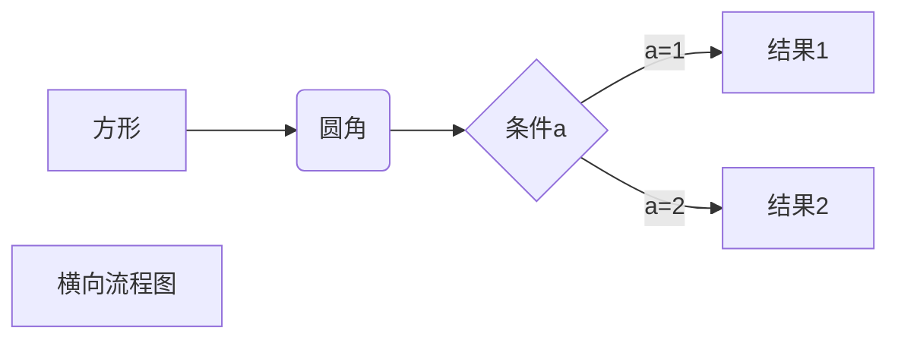

###### 1.1 简介

# 在终端中输出

### 1.echo

- 没有引号： <!--echo在每次调用后会添加一个换行符-->

  `echo Welcome to Bash`

+ 双引号： <!--双引号允许出现特殊字符-->

  `echo "Welcome to Bash"^`

  

- 单引号：<!--单引号不会对其做任何解释-->

  ` echo 'Welcome to Bash'`

- 转义换行符：<!--禁止换行--> <!--接受双包含转义-->

  `echo -n`	`echo -e "1\t2\t3"`

- 打印彩色输出：<!--彩色文本及背景-->

  `echo -e "\e[1;31m This is red text \e[0m"`

  `echo -e "\e[1;42m Green Background \e[0m"`

  

  - 文本颜色：
    - 重置=0；黑色=30；红色=31；绿色=32；黄色=33；蓝色=34；洋红=35；青色=36；白色=37；
  - 彩色背景：
    - 重置=0；黑色=40；红色=41；绿色=42；黄色=43；蓝色=44；洋红=45；青色=46；白色=47；

***

### 2.printf

- printf： <!--格式化字符串、不自动添加换行-->

  `printf "%-5s %-10s %-4s\n" No Name Mark`

- man console_codes 查看转移序列