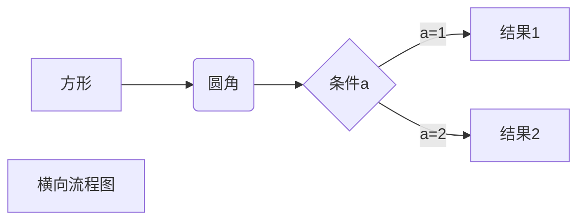

###### 1.1 简介

###### 1.2 在终端中输出

* echo

  * 没有引号:  echo Welcome to Bash <!--echo在每次调用后会添加一个换行符-->
  * 双引号:  echo "Welcome to Bash"  <!--双引号允许出现特殊字符-->
  * 单引号:  echo 'Welcome to Bash'  <!--单引号不会对其做任何解释-->

* printf

  * printf "%-5s %-10s %-4s\n" No Name Mark <!--格式化字符串、不自动添加换行-->

  

